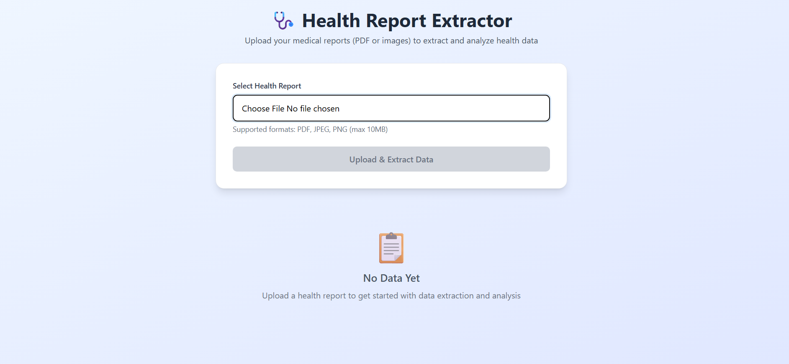
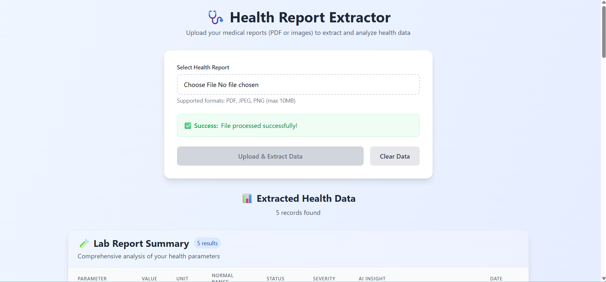
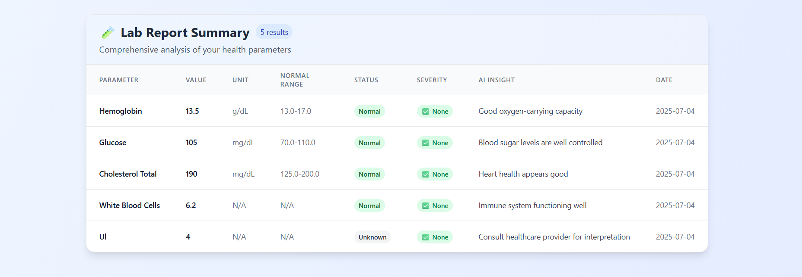
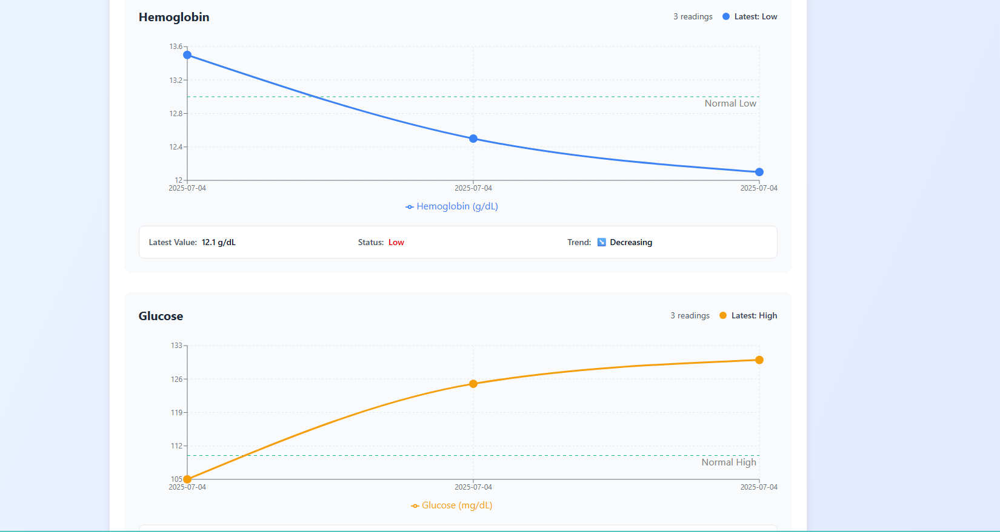
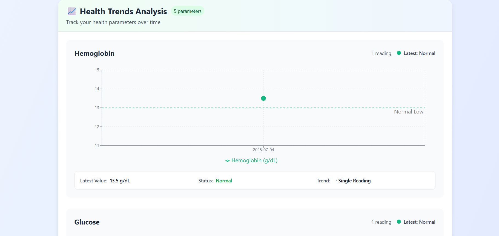

# Health Report Extractor

A robust FastAPI-based REST API for extracting health data from PDF and image files using OCR technology.

## Features

- 🔍 **Multi-format Support**: Process PDF files and images (JPEG, PNG)
- 🤖 **OCR Processing**: Extract text from images using Tesseract OCR
- 📊 **Data Extraction**: Intelligently parse health metrics with values, units, and ranges
- 🔒 **Validation**: File type and size validation
- 📝 **Logging**: Comprehensive logging for debugging and monitoring
- 🚀 **RESTful API**: Full CRUD operations for health records
- 📈 **Statistics**: Get insights about processed data

## Installation

### Prerequisites

- Python 3.8+
- Tesseract OCR installed on your system

#### Installing Tesseract OCR

**Windows:**
```bash
# Download from: https://github.com/UB-Mannheim/tesseract/wiki
# Or using chocolatey:
choco install tesseract
```

**macOS:**
```bash
brew install tesseract
```

**Linux (Ubuntu/Debian):**
```bash
sudo apt-get install tesseract-ocr
```

### Setup

1. Clone the repository:
```bash
git clone <repository-url>
cd health-checkup/server
```

2. Create a virtual environment:
```bash
python -m venv venv

# Windows
venv\Scripts\activate

# macOS/Linux
source venv/bin/activate
```

3. Install dependencies:
```bash
pip install -r requirements.txt
```

4. Run the server:
```bash
python main.py
```

The API will be available at `http://localhost:8000`

## API Documentation

### Interactive Documentation

- **Swagger UI**: `http://localhost:8000/docs`
- **ReDoc**: `http://localhost:8000/redoc`

### Endpoints

#### Health Check
- `GET /` - Basic health check
- `GET /health` - Detailed health status

#### File Processing
- `POST /upload` - Upload and process health report files

#### Records Management
- `GET /records` - Get all health records
- `GET /records/{record_id}` - Get specific record
- `DELETE /records/{record_id}` - Delete specific record
- `DELETE /records` - Clear all records

#### Analytics
- `GET /stats` - Get processing statistics
- `GET /files` - Get processed files metadata

## Usage Examples

### Upload a File

```bash
curl -X POST "http://localhost:8000/upload" \
  -H "Content-Type: multipart/form-data" \
  -F "file=@health_report.pdf"
```

### Get All Records

```bash
curl -X GET "http://localhost:8000/records"
```

### Get Statistics

```bash
curl -X GET "http://localhost:8000/stats"
```

## Configuration

### Environment Variables

You can configure the following environment variables:

```bash
# Maximum file size (default: 10MB)
MAX_FILE_SIZE=10485760

# Upload directory (default: uploads)
UPLOAD_DIR=uploads

# Log level (default: INFO)
LOG_LEVEL=INFO

# Server host (default: 0.0.0.0)
HOST=0.0.0.0

# Server port (default: 8000)
PORT=8000
```

## File Format Support

### Supported File Types
- PDF (.pdf)
- JPEG (.jpg, .jpeg)
- PNG (.png)

### File Size Limits
- Maximum file size: 10MB
- This can be configured via environment variables

## Data Extraction

The API uses advanced regex patterns to extract health data from text:

1. **Pattern Recognition**: Multiple regex patterns for different report formats
2. **Data Validation**: Validates extracted values and ranges
3. **Status Determination**: Automatically determines if values are normal or need attention
4. **Duplicate Prevention**: Prevents duplicate records from the same text

### Extracted Data Format

```json
{
  "id": "unique-uuid",
  "name": "Test Name",
  "value": 12.5,
  "unit": "mg/dL",
  "range": "10.0-15.0",
  "status": "Normal",
  "date": "2025-01-01",
  "file_id": "file-uuid",
  "created_at": "2025-01-01T12:00:00"
}
```

## Error Handling

The API provides comprehensive error handling:

- **400 Bad Request**: Invalid file type or format
- **413 Request Entity Too Large**: File size exceeds limit
- **422 Unprocessable Entity**: Cannot process file content
- **500 Internal Server Error**: Unexpected server errors

## Logging

The application logs important events:

- File uploads and processing
- Data extraction results
- Errors and warnings
- API requests and responses

Logs are formatted with timestamps and severity levels for easy monitoring.

## Security Considerations

- File type validation prevents malicious uploads
- File size limits prevent DoS attacks
- CORS configuration restricts cross-origin requests
- Input validation prevents injection attacks

## Performance

- Efficient PDF text extraction using pdfplumber
- Optimized OCR processing with custom Tesseract configuration
- In-memory data storage for fast retrieval
- Async request handling for better concurrency

## Production Deployment

For production deployment, consider:

1. **Database**: Replace in-memory storage with a proper database
2. **Authentication**: Add user authentication and authorization
3. **Rate Limiting**: Implement rate limiting for API endpoints
4. **File Storage**: Use cloud storage for uploaded files
5. **Monitoring**: Add application monitoring and alerting
6. **SSL**: Configure HTTPS for secure communication

## Development

### Running in Development Mode

```bash
# With auto-reload
uvicorn main:app --reload --host 0.0.0.0 --port 8000

# Or simply
python main.py
```

### Testing

The API includes comprehensive error handling and logging for easy debugging.

## Contributing

1. Fork the repository
2. Create a feature branch
3. Make your changes
4. Add tests if applicable
5. Submit a pull request

## License

This project is licensed under the MIT License.

## Screenshots

### Main Interface

*The main dashboard showing the file upload interface and health records overview*

### File Upload Process

*Drag and drop file upload interface with support for PDF and image files*

### Health Records Display

*Extracted health data displayed in a clean, organized table format*

### Data Visualization

*Interactive charts showing health metrics trends over time*

### Processing Results

*Real-time processing results showing extracted health metrics*
